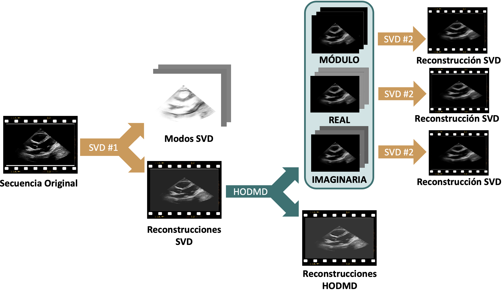

# AI-Based Cardiac Diagnosis from **Mice** and **Humans** Echocardiographies

> **Download the code repository before starting.**
> All scripts, notebooks, and utility modules required by this tutorial are available
> in the following repository:
>
> **Coming soon**: [codes](https://github.com/sanchez147304/prognosis_diagnosis_codes/tree/main/diagnosis_codes)
>
> Once downloaded, keep the folder structure intact — the scripts use relative imports
> that depend on it.

## Overview

This tutorial presents an end-to-end workflow for the automatic diagnosis of cardiac
pathologies from echocardiography (echo) image sequences. The pipeline combines modal
decomposition techniques — Singular Value Decomposition (SVD) and Higher-Order Dynamic
Mode Decomposition (HODMD) — with deep learning models based on the Vision Transformer
(ViT) architecture and Masked Autoencoders (MAE) to classify cardiac conditions from
sequences of ultrasound images.

The data used in this tutorial are echocardiography sequences stored either as DICOM
files or as folders of `.npy` frame arrays. Each sequence belongs to one cardiac
condition class (e.g. healthy, dilated cardiomyopathy, obese). The goal is to train a
model that classifies new, unseen sequences.

## Workflow

```
DICOM / .npy sequences
        │
        ▼
Step 1  Data preparation
        (DICOM reading · dataset organisation · normalisation)
        │
        ▼
Step 2  Modal decomposition pre-processing
        (SVD · HODMD-IT · Low-Cost HOSVD)
        │
        ▼
Step 3  Self-supervised pre-training
        (Masked Autoencoder — MAE, PyTorch)
        │
        ▼
Step 4  Supervised fine-tuning
        (Vision Transformer ViT with SPT + LSA, TensorFlow/Keras)
        │
        ▼
Step 5  Evaluation
        (frame-level · sequence-level · confusion matrix · reports)
```

---

## Step 1. Data Preparation

### 1.1 Dataset Organisation

The entire pipeline expects the dataset to be organised according to the following
directory structure:

```
dataset_split/          # e.g. ecos_orig_Training
    class_A/            # name of the cardiac condition
        sequence_001/
            frame_000.npy
            frame_001.npy
            ...
        sequence_002/
            ...
    class_B/
        sequence_001/
            ...
```

Each `.npy` file is a 2-D grayscale array representing one ultrasound frame. The
dataset must be split into three independent folders: **Training**, **Validation**, and
**Test**. These paths are set directly in the training and testing scripts.

### 1.2 Reading DICOM Files

Raw echocardiography data are typically delivered as DICOM (`.dcm`) files. The
`mainHODMD_IT.py` script (see Step 2) handles DICOM loading via `pydicom`. The
relevant block reads the pixel array, converts each frame to grayscale with OpenCV,
crops a region of interest, and saves the frames both as `.npy` arrays and as `.png`
images:

```python
import pydicom as dicom
import cv2

Tensor0 = dicom.dcmread(param['database_path']).pixel_array

ymin, ymax = 389, 780   # horizontal crop boundaries
xmin, xmax = 139, 650   # vertical crop boundaries

for n_frame in range(param['SNAP']):
    gray = cv2.cvtColor(Tensor0[n_frame, xmin:xmax, ymin:ymax, :],
                        cv2.COLOR_BGR2GRAY)
    # gray is a 2-D array ready to be saved as .npy
```

Adjust `xmin`, `xmax`, `ymin`, `ymax` to match the field-of-view of your scanner.

### 1.3 Normalisation

Before training a neural network, the per-channel mean and standard deviation of the
training set must be computed. The script
`Codes/Train-test/Normalization/normalization_orig.py` loads every `.npy` frame in the
training split, resizes it to the target resolution, and writes the statistics to a
text file.

Key parameters to configure inside the script:

| Parameter | Description | Default |
|-----------|-------------|---------|
| `input_data_directories` | List of training dataset root folders | — |
| `exported_filename` | Output `.txt` file with mean and std | `normalization_orig_224.txt` |
| `img_size` | Target spatial resolution `(H, W)` | `(224, 224)` |

Run the script before any training step:

```bash
python Codes/Train-test/Normalization/normalization_orig.py
```

The printed (and saved) values should then be copied into the data-augmentation
pipeline of the ViT training script (see Step 4).

---

## Step 2. Modal Decomposition Pre-processing

Modal decomposition methods provide an interpretable low-rank representation of the
spatio-temporal data. They are applied as a pre-processing step to reduce noise and
extract the dominant spatial modes and their temporal dynamics before the deep learning
stage.

### 2.1 SVD Analysis

The script `Codes/Tutorial-ModalDecomp/SVD/mainSVD_orig.py` performs a truncated
Singular Value Decomposition on each echocardiography sequence. The sequence is
arranged as a snapshot matrix `V ∈ R^{n_pixels × n_frames}` and decomposed as
`V ≈ U Σ W^T`, retaining only the modes whose singular values exceed a prescribed
tolerance.

The reconstructed frames (obtained by dropping noise-dominated modes) are saved as
`.npy` arrays and can be used as inputs to the AI training pipeline instead of the
original frames.

Supported input formats: `.mat`, `.npy`, `.csv`, `.pkl`, `.h5`, `.dcm`, and organised
`.sequences` folders. The script selects the appropriate loader automatically based on
the file extension.

Key parameters:

| Parameter | Description |
|-----------|-------------|
| `filetype` | Input format (`.sequences` for organised dataset folders) |
| `SNAP` | Number of snapshots; set to `None` to use the full temporal dimension |
| `varepsilon` | SVD tolerance — controls how many singular values are kept |

### 2.2 HODMD-IT — Higher-Order Dynamic Mode Decomposition (Iterative)

HODMD-IT extends classical DMD to tensorial data and iterates until the number of
retained singular values converges. It is the recommended decomposition method for
cardiac echo sequences because it captures periodic phenomena (heartbeat) more
faithfully.

**Script:** `Codes/Tutorial-ModalDecomp/HODMD/mainHODMD_IT.py`

The algorithm proceeds as follows for each sequence:

1. **HOSVD** — the tensor is decomposed along every spatial and temporal mode,
   reducing it to a small core tensor `hatT`.
2. **HODMD** on `hatT` — the reduced temporal matrix is decomposed into DMD modes,
   each characterised by a growth rate `δ_m`, an angular frequency `ω_m`, and an
   amplitude `a_m`.
3. **Reconstruction** — the full tensor is reconstructed from the retained modes.
4. **Convergence check** — the loop repeats until `nn_in == nn_out` (same number of
   retained singular values in two consecutive iterations).

The reconstruction quality is measured by the Relative Root-Mean-Square Error (RRMSE):

```
RRMSE = ‖V − V_reconst‖_F / ‖V‖_F
```

**Running the script interactively:**

```bash
python Codes/Tutorial-ModalDecomp/HODMD/mainHODMD_IT.py
```

The script will prompt you for the following parameters:

| Prompt | Recommended value | Description |
|--------|-------------------|-------------|
| Database path | path to your dataset folder | DICOM file or `.sequences` folder |
| Results path | path to output folder | Where results are saved |
| SVD library | `torch` | Backend for SVD (`numpy`, `torch`, `tensorflow`, `hybrid`) |
| SNAP | (press Enter) | Use all available frames |
| `varepsilon1` | `0.0005` | SVD tolerance |
| `varepsilon2` | `0.0005` | DMD mode tolerance |
| `d` | `/3` | DMD-d parameter (one third of snapshots is a good starting point) |
| `deltaT` | `0.004` | Time step between frames (seconds) |
| Complex data? | `n` | Echocardiography intensities are real-valued |

**Outputs saved under `results_path/DMD_solution/`:**

```
DMD_solution/
    reconstructed_images/       # reconstructed frames (.png)
    reconstructed_images_data/  # reconstructed frames (.npy)
    real_images/                # real part of DMD modes (.png)
    imag_images/                # imaginary part of DMD modes (.png)
    abs_images/                 # absolute value of DMD modes (.png)
    GrowthRates/                # frequency vs. growth-rate plots
    Amplitudes/                 # frequency vs. amplitude plots
    HOSVD_tols/                 # singular value decay plots
    RRMSE/                      # RRMSE per iteration (.txt)
    HODMD_times/                # execution times (.txt)
    HODMD_values/               # growth rates, frequencies, amplitudes (.npy)
    DMD_history.txt             # full log of the run
```

The reconstructed `.npy` data frames can be directly used as the input dataset for the
ViT training pipeline.

**Reference:**
Le Clainche, S. & Vega, J.M., *Higher order dynamic mode decomposition*,
SIAM J. Appl. Dyn. Sys., 16(2), pp. 882–925.

### 2.3 Low-Cost HOSVD (MATLAB)

For large tensors where memory or compute time is a bottleneck, the folder
`LowCostHOSVD_GOODalgorithm/` provides MATLAB implementations of a memory-efficient
HOSVD algorithm. Three variants are available depending on the tensor dimensionality:

| Script | Tensor dimensions | Use case |
|--------|-------------------|----------|
| `main_lcHOSVD_3DIM_mode3.m` | 3-D | Single grayscale frame sequence |
| `main_lcHOSVD_4DIM_multi2D.m` | 4-D | Multi-component 2-D sequence |
| `main_lcHOSVD_5DIM_multi3D.m` | 5-D | Multi-component 3-D sequence |

The standard HOSVD is also available as `main_HOSVD.m` for reference and comparison.

All scripts share the same interface: set the tensor dimensions and Tucker ranks `n`
at the top of the file, then run it in MATLAB. The singular value decay curves
produced help to choose appropriate ranks for each mode:

```matlab
% In main_HOSVD.m: choose Tucker ranks based on singular value decay
n = [3, 6, 6, 6, 4];   % one rank per tensor mode

% Run standard HOSVD
[TT, S_core, U, sv, n_out] = hosvd(Tensor, n);
```

### Pre-processing Pipeline Overview

The figure below summarises the complete modal decomposition pre-processing workflow.
Starting from the original echocardiography sequence, a first SVD step (SVD #1)
extracts the dominant spatial modes and produces low-rank SVD reconstructions. These
reconstructions are then fed into two parallel branches:

- **HODMD branch** — applies the iterative HODMD algorithm to capture the temporal
  dynamics of the cardiac cycle and produce HODMD reconstructions.
- **SVD #2 branch** — applies a second SVD pass on the module, real, and imaginary
  components of the HODMD modes, yielding three independent sets of SVD reconstructions.



---

## Step 3. Self-Supervised Pre-training with MAE

**Script:** `Codes/Train-test/Train-test/train_mae__demo-modelflowsapp_diagnosis__orig.py`

A Masked Autoencoder (MAE) is pre-trained on the labelled echocardiography data in a
self-supervised fashion before the supervised classification step. The MAE learns
rich visual representations by reconstructing randomly masked patches, without
requiring class labels.

The implementation uses PyTorch and is built on top of the `timm` library. The main
components are:

- `model_mae_image_loss.py` — MAE encoder–decoder architecture.
- `engine_two_branch.py` — training and evaluation loops.
- `util/datasets.py` — dataset builder that loads the organised `.sequences` folders.

Key training parameters set at the top of the script:

| Parameter | Description | Default |
|-----------|-------------|---------|
| `training_database_path` | List of training split root folders | — |
| `validation_database_path` | List of validation split root folders | — |
| `excluded_classes` | Class names to ignore | `[]` |
| Batch size | Mini-batch size | defined in the arg parser |
| Epochs | Number of training epochs | defined in the arg parser |

**Running pre-training:**

```bash
python Codes/Train-test/Train-test/train_mae__demo-modelflowsapp_diagnosis__orig.py \
    --epochs 400 \
    --batch_size 64 \
    --output_dir /path/to/save/mae_weights
```

The pre-trained encoder weights are used to initialise the ViT classifier in Step 4.

**Testing the MAE reconstruction** (optional sanity check):

```bash
python Codes/Train-test/Train-test/test_mae__demo-modelflowsapp_diagnosis__orig__orig-test.py
```

---

## Step 4. Supervised Fine-tuning with the Vision Transformer (ViT)

### 4.1 Model Architecture

**Script:** `Diagnosis_scripts/train_vit_modelflows-app.py`

The classification model is a modified ViT for small datasets implemented in
TensorFlow/Keras (`Diagnosis_scripts/Training/model.py`). Two improvements over the
vanilla ViT are incorporated:

**Shifted Patch Tokenization (SPT)** — instead of extracting non-overlapping patches
from the original image only, five versions of each image are concatenated along the
channel axis (original plus four diagonal shifts of half the patch size) before
patchification. This gives the model access to cross-patch boundary information.

**Locality Self-Attention (LSA)** — a learnable temperature scalar `τ` is introduced
in the multi-head attention mechanism and a diagonal attention mask prevents each patch
from attending to itself. Both modifications improve the model's performance on
small-scale datasets.

The model function signature:

```python
model = create_vit_classifier(
    used_data_augmentation_techniques,   # Keras Sequential augmentation pipeline
    input_shape  = (256, 256, 1),        # (H, W, channels) — grayscale echo images
    image_size   = 256,
    patch_size   = 32,
    transformer_layers = 8,
    num_heads    = 4,
    projection_dim    = 64,
    transformer_units = [128, 64],
    mlp_head_units    = [512, 256],
    num_classes  = N,                    # number of cardiac conditions
    vanilla      = False,                # False → SPT + LSA; True → vanilla ViT
)
```

### 4.2 Data Augmentation Pipeline

The augmentation pipeline (`Diagnosis_scripts/Utils/datasets.py`) is applied
**only during training** and consists of five sequential transformations:

```python
data_augmentation = keras.Sequential([
    layers.Normalization(),                                   # z-score: (x − μ) / σ
    layers.Resizing(target_size[0], target_size[1]),         # resize to target
    layers.RandomFlip("horizontal"),                          # horizontal mirror
    layers.RandomRotation(factor=0.02),                      # ±7° random rotation
    layers.RandomZoom(height_factor=0.2, width_factor=0.2),  # ±20 % random zoom
])
```

The `Normalization` layer must be adapted to the training data before the model is
built:

```python
data_augmentation.layers[0].adapt(x_train)
```

### 4.3 Balanced Batch Generator

The batch generator (`Diagnosis_scripts/Training/batch_generator.py`) ensures that
each mini-batch contains an equal number of samples from every class. This prevents
the model from being biased towards over-represented pathologies:

- `batch_size // num_classes` samples are drawn uniformly (without replacement) from
  each class per batch.
- Any remaining slots are filled with randomly selected samples from random classes.

### 4.4 Training Setup

Edit the `param` dictionary at the top of `train_vit_modelflows-app.py`:

```python
param['training_database_path']   = ['/path/to/ecos_orig_Training']
param['validation_database_path'] = ['/path/to/ecos_orig_Validation']
param['target_size']   = (256, 256)
param['num_channels']  = 1          # 1 for grayscale echo images
param['patch_size']    = 32
param['n_blocks']      = 8
param['n_heads']       = 4
param['projection_dim']     = 64
param['transformer_units']  = [128, 64]
param['mlp_head_units']     = [512, 256]
param['batch_size']    = 64
param['device']        = 0          # GPU index; -1 for CPU
param['lr']            = 0.001
param['weight_decay']  = 0.0001
param['n_epochs']      = 200
param['steps_per_epoch']    = 500
param['validation_steps']   = 300
param['model_save_path']    = '/path/to/save/model'
```

Then launch training:

```bash
python Diagnosis_scripts/train_vit_modelflows-app.py
```

The optimizer is AdamW (from `tensorflow_addons`) with a warmup cosine-decay learning
rate schedule: the learning rate linearly ramps up during the first 10 % of training
steps and then follows a cosine decay to zero.

**Training callbacks** (`Diagnosis_scripts/Training/callbacks.py`) manage:

- `TensorBoard` — logs training/validation metrics and the computational graph.
- `ModelCheckpoint` — saves weights whenever `val_accuracy` improves.
- `WarmupCosineDecay` — implements the LR schedule described above.
- `PerformanceVisualizationCallback` — saves a confusion matrix and ROC curve at the
  end of each epoch.
- `Results_evaluation_callback` — logs epoch times and resource usage to a `.txt` file.

> **Note:** Training 200 epochs on CPU takes many hours. It is strongly recommended to
> use a GPU (`param['device'] = 0`). A pre-trained checkpoint is provided in
> `Diagnosis_scripts/pre-trained-vit.h5`.

---

## Step 5. Testing and Evaluation

**Script:** `Diagnosis_scripts/test_vit_modelflows-app.py`

### 5.1 Configuration

Set the paths and parameters at the top of the testing script:

```python
param['model_path_test']     = '/path/to/pre-trained-vit.h5'
param['training_database_path']   = ['/path/to/ecos_orig_Training']   # needed for label encoder
param['validation_database_path'] = ['/path/to/ecos_orig_Validation'] # needed for label encoder
param['test_database_path']  = ['/path/to/ecos_orig_Test']
param['target_size']         = (256, 256)
param['num_channels']        = 1
param['device']              = 0     # GPU index; -1 for CPU
param['test_results_path']   = '/path/to/save/results'
param['sequence_classification'] = 1  # 1 to also run sequence-level evaluation
```

### 5.2 Running the Test

```bash
python Diagnosis_scripts/test_vit_modelflows-app.py
```

You can also run the equivalent Jupyter notebook for an interactive experience:

```bash
jupyter notebook Diagnosis_scripts/test_diagnosis_modelflows_app.ipynb
```

### 5.3 Frame-Level Classification

The model predicts a class probability vector for each frame independently. The
predicted class is the `argmax` of this vector. The results are exported to:

```
test_results_<timestamp>/
    test_prediction_stats.csv          # per-frame GT, prediction and confidence
    test_data_loading_times.csv        # data loading times
    prediction_times.csv               # inference times
    confusion_matrix.csv / .png        # frame-level confusion matrix
    classification_report_*.csv        # precision, recall, F1 per class
```

### 5.4 Sequence-Level Classification

When `param['sequence_classification'] = 1`, the frame-level predictions are
aggregated per sequence using two strategies:

- **Mean** — the mean of the predicted probability vectors across all frames in the
  sequence; the predicted class is the `argmax` of the mean vector.
- **Max** — the maximum of the predicted probability vectors across all frames; the
  predicted class is the `argmax` of the max vector.

The per-sequence results are saved to:

```
test_results_<timestamp>/
    test_seq_prediction_stats.csv      # per-sequence GT, prediction and confidence
    confusion_matrix_mean.csv / .png
    confusion_matrix_max.csv  / .png
    confusion_matrix_mean_seq.csv / .png
    confusion_matrix_max_seq.csv  / .png
    seq_analysis/
        Prid_per-image_<seq>.png       # frame-by-frame predicted class in each sequence
        Conf_per-image_<seq>_<cls>.png # per-frame confidence for each class
```

---

## Results

A successfully trained model achieves high frame-level and sequence-level accuracy on
the echocardiography test split. The confusion matrices reveal which cardiac conditions
are most easily confused. The per-sequence aggregation (especially the **mean**
strategy) typically outperforms the frame-level classifier because it averages out
transient artefacts in individual frames.

The DMD mode plots produced in Step 2 show the dominant oscillatory patterns in the
cardiac cycle: the mode at the fundamental heartbeat frequency carries the largest
amplitude, and harmonics appear at integer multiples. Modes with large growth rates
indicate non-stationary components (e.g. breathing artefacts).

---

## Related Links

- Notebook (training): `Diagnosis_scripts/train_diagnosis_modelflows_app.ipynb`
- Notebook (testing): `Diagnosis_scripts/test_diagnosis_modelflows_app.ipynb`
- Notebook (image viewer): `Diagnosis_scripts/view_images_npy.ipynb`
- Video: —
- Dataset: —
- Repository: —

---

## Contributors

- Andrés Bell
- Andres Sanchez
- Zhuoqun Zao


